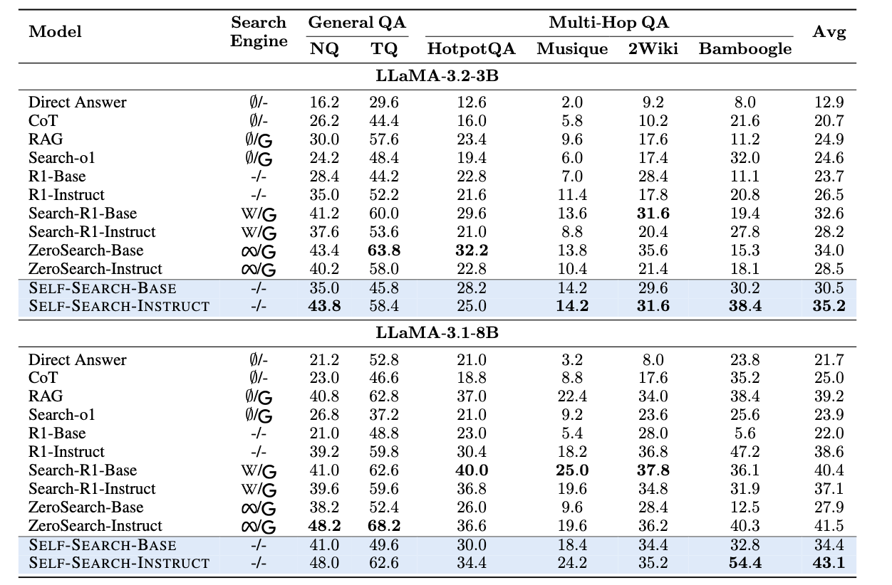

<div align="center">

# SSRL

[](https://arxiv.org/abs/2504.16084)  [](https://github.com/YuchenFan48/SSRL)
[](https://wandb.ai/yuchenfan/Rethink%20Search%20Scaling/reports/SSRL--VmlldzoxMzg3Nzc0NA)

</div>

<div align="center" style="font-family: Arial, sans-serif;">
  <p>
    <a href="#news" style="text-decoration: none; font-weight: bold;">🎉 News</a> •
    <a href="#introduction" style="text-decoration: none; font-weight: bold;">📖 Introduction</a> •
    <a href="#main-results" style="text-decoration: none; font-weight: bold;">📊 Main Results</a>
  </p>
  <p>
    <a href="#getting-started" style="text-decoration: none; font-weight: bold;">✨ Getting Started</a> •
    <a href="#contact" style="text-decoration: none; font-weight: bold;">📨 Contact</a> •
    <a href="#citation" style="text-decoration: none; font-weight: bold;">🎈 Citation</a> •
    <a href="#star-history" style="text-decoration: none; font-weight: bold;">🌟 Star History</a>
  </p>
</div>

> Welcome to the Era of Experience.  --David Silver, Richard S. Sutton

<!-- # 🎉News

- **[2025-05-23]** We update both the paper and the code, with the implementation based on the [verl](https://github.com/volcengine/verl).

- **[2025-04-24]** We release the code and experimental logs. Check it out: [Getting Started](#getting-started).

- **[2025-04-23]** We present **TTRL** (Test-Time Reinforcement Learning), an open-source solution for online RL on data without ground-truth labels, especially test data. -->

# 📖Introduction

**We investigate Reinforcement Learning (RL) on Agentic search tasks without explicit gathering information from external search engines, e.g., LLMs, web engines.**
Previous work leverage external search engines during training, which is expensive and time-consuming, yet introducing training instability. We introduce SSRL, a novel approach that enables RL on Agentic search tasks without the need for explicit search engines which achieves comparable performance to previous methods. Though trained totally offline, it can be seamlessly applied to online search engines, and further boost its performance. 

<p align="center">
   
</p>

<!-- 
<p align="center">
   
</p> -->


# 📊Main Results

Our experiments demonstrate that SSRL consistently improves performance across a variety of tasks and models. 

Furthermore, although SSRL is trained offline, it can be seamlessly applied to online search engines, further boosting its performance.

<p align="center">
   
</p>

<p align="center">
   
</p>


# ✨Getting Started

You can reproduce the results of SSRL with the following commands:

```bash
git clone https://github.com/YuchenFan48/SSRL
cd verl

pip install -r requirements.txt

huggingface-cli download --repo-type dataset --resume-download yuchenFan/SSRL --local-dir SSRL_dataset # download the dataset

bash examples/ssrl/example.sh
```

*All experiments were conducted on 8 x NVIDIA A800 80GB GPUs.*

# 📨Contact

- Kaiyan Zhang: zhang-ky22@mails.tsinghua.edu.cn

- Ning Ding: dingning@mail.tsinghua.edu.cn

# 🎈Citation
If you find SSRL helpful, please cite us.

```bibtex
<!-- @article{zuo2025ttrl,
  title={Ttrl: Test-time reinforcement learning},
  author={Zuo, Yuxin and Zhang, Kaiyan and Qu, Shang and Sheng, Li and Zhu, Xuekai and Qi, Biqing and Sun, Youbang and Cui, Ganqu and Ding, Ning and Zhou, Bowen},
  journal={arXiv preprint arXiv:2504.16084},
  year={2025}
} -->
```

# 🌟Star History

[](https://www.star-history.com/#PRIME-RL/TTRL&Date)